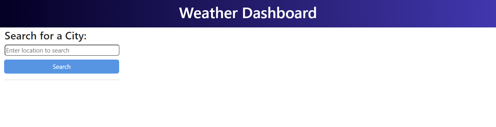
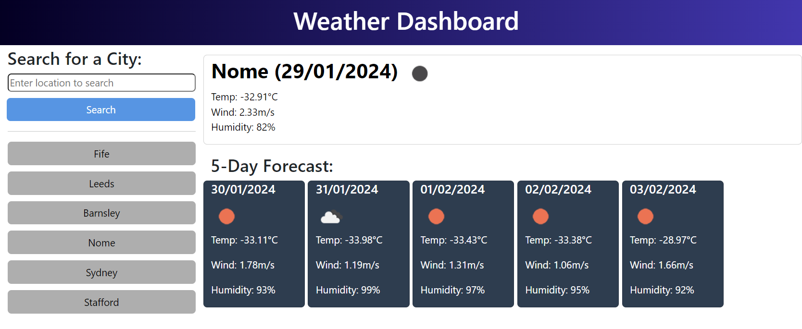

# Work Day Schedule

## Description
This app allows a user to view the current (and future) weather for an entered location.

## Table of Contents
* [Links](#links)
* [Installation](#installation)
* [Usage](#usage)
* [Screenshots](#screenshots)
* [License](#license)
* [Features](#features)

## Links
- [Repo](https://github.com/cadbuckle/weather-forecast)
- [Live](https://cadbuckle.github.io/weather-forecast/)

## Installation
Saved search history is held locally in the browser in a key called "wk08-weather-history".

## Usage
Upon first run, the screen will prompt for a location whose weather will then be displayed.

Each location searched for will be added at the top of the search history. If the location is already in the list, it will not be re-added. A maximum of 6 locations will be stored. If the list already contains 6 locations, the locatoin at the bottom of the list will be removed.

Each entry in the search history can be "searched again" simply by clicking the location in the list.

## Screenshots
### Screenshot 1 - No locations searched
</img>
### Screenshot 2 - Searched item
</img>
### Screenshot 3 - Showing previously searched locations
</img>

## License
MIT License as per repository.

## Features
JavaScript, notably:
- API query to OpenWeatherMap
- Display of returned current and forecast weather data
- Local Storage: for recording the searched locations

## Acknowledgements
Thanks to:
* Bootcamp Lessons
* OpenWeatherMap.org

© 2024 edX Boot Camps LLC. Confidential and Proprietary. All Rights Reserved.
